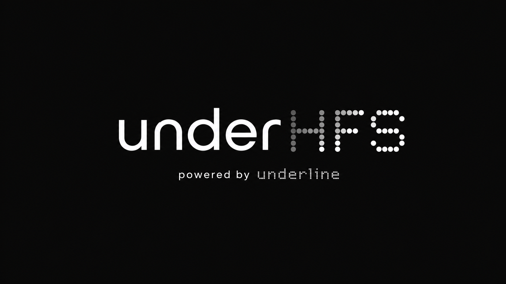

<div align="center">
  
  <h1>underHFS</h1>
  <p><strong>Own the runtime. Train beyond the box.</strong></p>
</div>

Build, train, serve, and scale AI systems without giving up control of the
runtime.

underHFS is a PyTorch-style AI framework foundation for people who want to own
the stack: tensors, autograd, neural network modules, optimizers, runtime
policies, serving, and the path toward native C++/CUDA execution. It starts with
a working Python fallback backend today and grows toward a high-performance
CUDA-first engine for LLMs, multimodal models, vision systems, streaming
inference, and game-learning agents.

This is not a wrapper around PyTorch. PyTorch and NumPy are allowed only as
external test and benchmark oracles.

## Why underHFS

- **Own the runtime**: keep the public API Torch-like while building the core
  around underHFS storage, autograd, scheduling, and memory policies.
- **Train beyond one memory tier**: design for VRAM, RAM, NVMe, and future
  distributed tiers through explicit runtime policies.
- **Go CUDA-first**: prepare the native backend for C++20, pybind11, CUDA 13.x,
  cuBLAS, cuDNN, NCCL, custom kernels, and stream-aware scheduling.
- **Support real model families**: provide the early blocks for transformers,
  convolutional models, RL-style heads, serving, and live-streaming workflows.
- **Stay inspectable**: ship a small executable fallback implementation that can
  be tested locally before the native backend is installed.

## What Works Now

- Tensor metadata, dtype/device/layout declarations, CPU fallback storage,
  broadcasting, matmul, reductions, reshape, transpose, softmax, and in-place
  version counters.
- Reverse-mode autograd for scalar losses, elementwise ops, matmul, softmax,
  embedding, and conv2d fallback paths.
- `nn.Module`, `Parameter`, `Linear`, `Embedding`, `Conv2d`, `RMSNorm`,
  `SelfAttention`, `TransformerBlock`, `MSELoss`, and `CrossEntropyLoss`.
- `SGD`, `AdamW`, fused/ZeRO-aware optimizer API surfaces.
- DataLoader, runtime policies, compile policies, distributed wrappers,
  checkpoint serialization, serving facade, native-core detection, and CLI smoke
  commands.
- CMake + pybind11 native extension scaffold and CUDA kernel scaffold gated
  behind `UNDERHFS_WITH_CUDA`.

## Product Surface

underHFS is organized around the same surfaces a full-stack AI platform needs:

- `underhfs.tensor`: Tensor, dtype, device, layout, fallback operations.
- `underhfs.autograd`: eager backward and future forward-mode/JVP entrypoints.
- `underhfs.nn`: modules, parameters, transformer blocks, CNN/RL foundations.
- `underhfs.optim`: SGD, AdamW, fused optimizer and ZeRO-aware optimizer shapes.
- `underhfs.data`: Dataset/DataLoader primitives.
- `underhfs.compile`: graph IR, compile policy, fusion policy surface.
- `underhfs.cuda`: runtime, precision, memory-tier, and CUDA availability policy.
- `underhfs.distributed`: data/tensor/pipeline/ZeRO policy surface.
- `underhfs.serve`: Python serving facade and streaming protocol definitions.

## Quick Start

Use the source tree directly while the native backend is still being brought up:

```powershell
$env:PYTHONPATH = "src"
python -m underhfs.cli test
python -m underhfs.cli bench
```

Editable install:

```powershell
python -m pip install -e . --no-build-isolation
underhfs test
underhfs bench
```

The built-in `underhfs test` command exists so local verification works even
before `pytest` is installed.

## Native Backend Path

The native backend is scaffolded but not required for the Python fallback.

Required tools:

- Python 3.13
- Git
- Visual Studio 2022 Build Tools with the C++ workload
- CMake 3.28+
- Ninja
- CUDA Toolkit 13.x

On this machine, Python 3.13.12, Git, and CMake are present. CUDA Toolkit
`nvcc` and Ninja still need to be installed or added to `PATH` before native
CUDA builds can run. See `docs/build.md`.

## Design Promise

underHFS aims for PyTorch-like ergonomics without becoming PyTorch-dependent.
Unsupported hardware, missing native kernels, or unavailable memory policies
should fail loudly with clear guidance instead of silently falling back into
unknown performance or accuracy behavior.

The long-term benchmark target is simple and brutal: match or beat PyTorch on
the same hardware for both throughput and model quality, while exposing memory
and execution policies that make large-model workloads easier to control.
