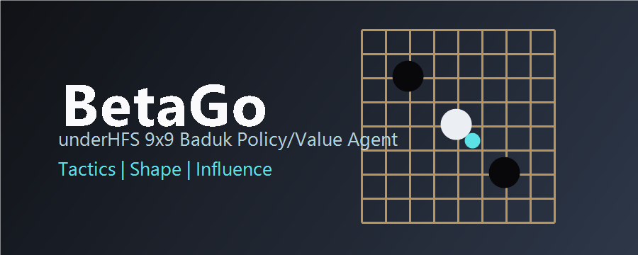

  

# BetaGo underHFS Agent Report

## Scope

This test project trained BetaGo, a small 9x9 Baduk policy/value agent using underHFS
Tensor, autograd, nn modules, optimizer, and serialization. The project does not
claim professional Go strength or real mastery of divine moves. Instead, it
tests whether underHFS can run an end-to-end agent-training workflow over
rule-aware, strategy-labeled Baduk positions.

## Training Setup

- Board: 9x9
- Input features: own stones, opponent stones, legal moves, side-to-move plane
- Model: Linear(324, 32) -> ReLU -> Linear(32, 16) -> ReLU with policy/value heads
- Optimizer: underHFS AdamW
- Training samples: 96
- Evaluation samples: 32
- Steps: 60
- Batch size: 8

## Strategy Labels

Synthetic labels include capture, atari, defend-atari, connection, side extension,
corner framework, center influence, and shape balance. These are heuristic
training targets, not game-record-supervised professional moves.

## Final Metrics

- Policy top-1 accuracy: 0.500
- Policy top-3 accuracy: 0.875
- Value MAE: 0.236

## Accuracy By Strategy

| Strategy | Top-1 Accuracy |
| --- | --- |
| atari | 0.000 |
| capture | 1.000 |
| center_influence | 1.000 |
| connect | 1.000 |
| corner_framework | 0.000 |
| defend_atari | 1.000 |
| shape_balance | 0.000 |
| side_extension | 0.000 |

## Artifacts

- Model checkpoint: `C:\Users\LEE\Desktop\underhfs\project\BetaGo\artifacts\betago_agent_state.json`
- Metrics JSON: `project/BetaGo/artifacts/metrics.json`

## Limitations

- No self-play search, MCTS, SGF/pro game corpus, life-and-death solver, ko/superko
  history, komi, territory scoring, or full board-size 19x19 training is included.
- "God move" behavior is represented only as selecting the highest-scoring move
  under the handcrafted tactical/shape heuristic. It is not evidence of superhuman
  Go ability.
- The purpose is to validate underHFS as a local training runtime and produce a
  reproducible BetaGo baseline project for future stronger Baduk experiments.
